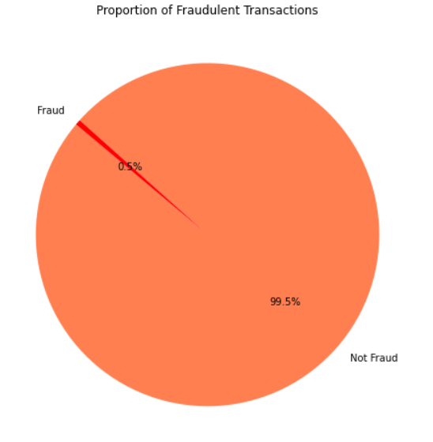
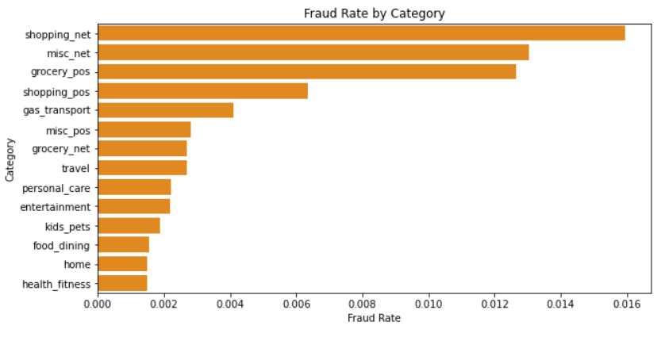
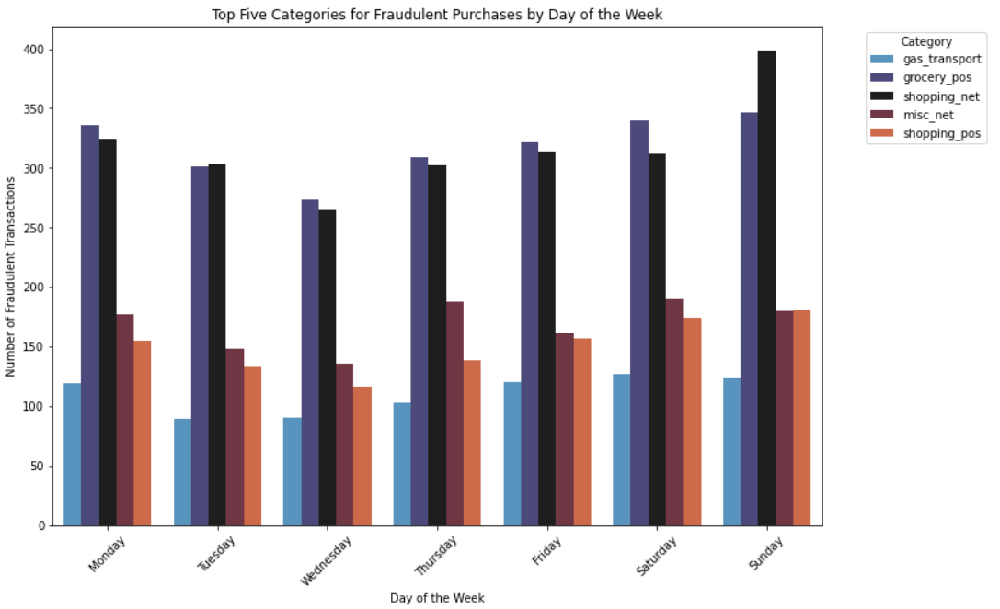
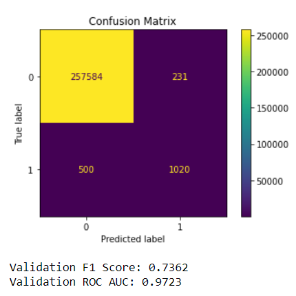

# Fraud-Prediction

Table of Contents

[***Project Overview:***](#project-overview)

[***Visualisations using Stills:***](#visualisations-using-stills)

[***Conclusion:***](#conclusion)

[***Notebooks:***](#notebooks)

## Project Overview
I've been hired by American Express. 
As part of a key initiative undertaken by American Express, 
this project is dedicated to developing a machine-learning model aimed at predicting whether a transaction is fraudulent or legitimate.
The overarching goal is to enhance the security and reliability of American Express's transaction processing, thereby safeguarding customer interests and maintaining the integrity of their financial well-being.

# Dataset Description
This is a simulated credit card transaction dataset containing legitimate and fraudulent transactions from the duration of 1st Jan 2019 to 31st Dec 2020.
It covers credit cards of 1000 customers doing transactions with a pool of 800 merchants.

[datasetlink](https://www.kaggle.com/datasets/kartik2112/fraud-detection)

## Visualisations Using stills

Take a look at how imbalanced this dataset is.

In this image, we see a lot of fraudulent purchases we're online or at the grocery store.

In this image, we see the top five categories.

Model Performance
High Overall Accuracy: 99.72% in identifying transactions.
Fraud Detection: F1 Score of 0.7362, ROC AUC of 0.9723.
Strength: Excellent at identifying legitimate transactions.
Area to Improve: Boosting fraud detection effectiveness.

## Conclusion
Moving forward, our focus will be on refining the model to enhance its fraud detection capabilities. 
This will involve exploring more advanced data processing techniques, fine-tuning the model parameters,
and possibly integrating additional methodologies to improve the balance between accurately detecting fraud and maintaining high overall performance. 
Our goal is to develop a robust system that excels in both detecting fraud and correctly identifying legitimate transactions.

## Recommendations
- Continue to make advances in machine learning to help better detect these fraud patterns 

- require two=factor authentication for accounts 

- offer a free fraud awareness program

- implement 24/7 support to report fraud and resolve security issues

## Notebooks
* [Cleaning](Notebook/Cleaning.ipynb)

* [Exploratory Data Analysis](Notebook/EDA.ipynb)

* [Models](Notebook/Models.ipynb)

## Linkedin
Gavin Martin 

Thank you for taking a look at my capstone, feel free to connect with me on LinkedIn!

## References
[Credit Card Image](https://unsplash.com/photos/closeup-photo-of-american-express-business-card-on-brown-surface-x8i6FfaZAbs)
